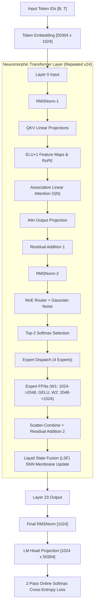

# Jarvis-Q1.58-500M: Architecture Specification

## 1. Executive Summary

**Jarvis-Q1.58-500M** is a 606-million parameter Neuromorphic Transformer designed to eliminate the quadratic memory and compute bottlenecks of conventional transformers. It combines:

1. **$O(N)$ Infinite Associative Linear Attention** with learnable per-head recurrent decay.
2. **Spiking Ternary Weight Quantization ($Q_{1.58}$)** with Straight-Through Estimators (STE).
3. **Sparse Mixture-of-Experts (MoE)** featuring 4 experts with strictly locked Top-2 routing.
4. **Liquid State Fusion (LSF)** continuous-time Spiking Neural Network (SNN) membrane dynamics.
5. **Reflective Regularization** to constrain neural activation drift.

---

## 2. Model Dimensions & Hyperparameter Manifest

| Hyperparameter | Value | Description |
| :--- | :---: | :--- |
| **Total Parameters** | **606,448,657** (~606.4M) | Complete parameter count across all modules |
| **Active Parameters / Token** | **353,600,000** (~353.6M) | Active parameters engaged per forward token pass |
| **Transformer Layers ($L$)** | **24** | Identical repeating neuromorphic blocks |
| **Hidden Dimension ($d_{\text{model}} / C$)** | **1024** | Model activation vector width across all layers |
| **Attention Heads ($H$)** | **16** | Head dimension $D = 64$ ($16 \times 64 = 1024$) |
| **KV Heads** | **16** | Full multi-head linear attention (no GQA) |
| **Attention Chunk Size** | **64** | Intra-chunk parallelization tile dimension |
| **Number of MoE Experts ($E$)** | **4** | Expert feed-forward networks per layer |
| **Active Routing ($K_{\text{active}}$)** | **Top-2 (Locked)** | Exactly 2 of 4 experts active per token |
| **Expert Hidden Dimension** | **2048** | FFN expansion ratio = $2.0\times$ |
| **Vocabulary Size ($V$)** | **50,257** | GPT-2 BPE standard (`tiktoken`) |
| **Padded Vocabulary ($V_{\text{pad}}$)** | **50,304** | Padded for 64/128-element Tensor Core MMA alignment |
| **Context Length ($T$)** | **512** tokens | Standard training sequence length |
| **Normalization** | **RMSNorm** | Root Mean Square Layer Normalization ($\epsilon = 10^{-6}$) |
| **Activation Function** | **GELU** | In-place Gaussian Error Linear Unit |
| **Precision** | **BF16 / FP32** | BF16 weights/activations; FP32 optimizer moments |

---

## 3. High-Level Dataflow & DAG



---

## 4. Core Mathematical Components

### 4.1 Infinite Associative Linear Attention $O(N)$
Standard softmax attention requires $O(N^2)$ quadratic memory and compute. Jarvis implements an $O(N)$ associative linear recurrence with learnable per-head decay:

$$S_t = \gamma \cdot S_{t-1} + V_t \otimes K_t^T$$
$$Z_t = S_t \cdot Q_t$$

* **Decay Factor ($\gamma$):** Each head possesses an independent learnable scalar decay parameter:
  $$\gamma = \text{sigmoid}(\gamma_{\text{raw}})$$
  allowing some heads to maintain long-range memory while others act as local window detectors.
* **Kernel Feature Maps:** Both queries ($Q$) and keys ($K$) are mapped through Katharopoulos-style $\text{ELU}(x) + 1$ activations to ensure non-negative inner products and numerical stability.
* **Vectorized Chunking:** Tokens are grouped into 64-token chunks. Intra-chunk attention is evaluated via causal masked matrix multiplication, while cross-chunk state is propagated through recurrent outer-product state tensors $S \in \mathbb{R}^{B \times H \times D \times D}$.

### 4.2 Spiking Ternary Quantization ($Q_{1.58}$)
All projection weights (QKV, Attention Out, and MoE Experts) are quantized into ternary values $\{-1, 0, +1\}$ following the BitNet $b1.58$ formulation:

$$\alpha = \text{mean}(|W|)$$
$$W_{\text{ternary}} = \text{clamp}\left(\text{round}\left(\frac{W}{\alpha + 10^{-8}}\right), -1, 1\right)$$
$$W_{\text{quant}} = W_{\text{ternary}} \cdot \alpha$$

* **AbsMean Scaling:** Dynamically centers the weight distribution to prevent quantization collapse. Weights maintain approximately **30% zeroes, 35% $+1\alpha$, and 35% $-1\alpha$**.
* **Straight-Through Estimator (STE):** During backpropagation, gradients pass through unquantized within clipping thresholds:
  $$\frac{\partial \mathcal{L}}{\partial W} \approx \frac{\partial \mathcal{L}}{\partial W_{\text{quant}}} \cdot \mathbf{1}_{\{|W| \le 1.0\}}$$

### 4.3 Sparse Mixture-of-Experts (MoE) with Top-2 Routing
Each layer replaces the monolithic feed-forward network with 4 independent expert networks:
* **Router Gating:** Given normalized activation $x$, routing logits are computed with exploratory Gaussian noise:
  $$g = x \cdot W_{\text{router}} + \mathcal{N}(0, \sigma^2)$$
* **Top-2 Selection:** Softmax probabilities are computed over the top 2 indices; all other experts receive 0 weight.
* **Load-Balancing Auxiliary Loss:** To prevent expert starvation and load imbalance:
  $$\mathcal{L}_{\text{balance}} = \alpha_{\text{bal}} \cdot E \sum_{i=1}^E f_i \cdot P_i$$
  where $f_i$ is the fraction of tokens routed to expert $i$, and $P_i$ is the mean gating probability.

### 4.4 Liquid State Fusion (LSF) SNN Dynamics
To model biological neural membrane potentials, expert outputs pass through an adaptive Leaky Integrate-and-Fire (LIF) continuous dynamical system discretised as an Exponential Moving Average (EMA):

$$H_t = \alpha_{\text{dyn}} \cdot H_{t-1} + (1 - \alpha_{\text{dyn}}) \cdot M_t$$

* **Dynamic Decay Rate ($\alpha_{\text{dyn}}$):** Derived dynamically from the spatial variance of expert outputs:
  $$\alpha_{\text{dyn}} = \alpha_{\text{min}} + (\alpha_{\text{max}} - \alpha_{\text{min}}) \cdot \text{sigmoid}(-\text{scale} \cdot \text{Var}(M))$$
* Membrane states persist across token processing, maintaining continuous temporal memory.

### 4.5 Reflective Regularization
Penalizes divergence in activation distributions across batches:

$$\mathcal{L}_{\text{reflect}} = \lambda \cdot \left[ (\mu_{\text{batch}} - \mu_{\text{target}})^2 + \max(0, \sigma^2_{\text{batch}} - \tau_{\text{max}}) \right]$$

---

## 5. Detailed Parameter Inventory

```
================================================================================
COMPONENT                               SHAPE / FORMULA              PARAMETERS
================================================================================
Token Embedding Matrix                  50,304 x 1,024               51,511,296
Final RMSNorm Weight                    1,024                             1,024
LM Head Projection Matrix               1,024 x 50,304               51,511,296
--------------------------------------------------------------------------------
Per Transformer Layer (x24 layers):
  - RMSNorm-1 Weight                    1,024                             1,024
  - QKV Projection (3 matrices)         1,024 x 3,072                 3,145,728
  - Attn Output Projection              1,024 x 1,024                 1,048,576
  - RMSNorm-2 Weight                    1,024                             1,024
  - MoE Router Weight                   1,024 x 4                         4,096
  - Expert W1 Matrices (4 experts)      4 x (1,024 x 2,048)           8,388,608
  - Expert W2 Matrices (4 experts)      4 x (2,048 x 1,024)           8,388,608
  - Per-Head Gamma Scalars              16 heads                             16
  - LSF Variance Scale Scalar           1 scalar                              1
  Subtotal per Layer                                                 20,977,681
  Total for 24 Layers                                               503,425,041
================================================================================
TOTAL MODEL PARAMETERS                                              606,448,657
================================================================================
```

---

## 6. Execution Implementations

The repository maintains two synchronized implementations:

### A. Python / PyTorch Reference (`jarvis_engine/jarvis_model.py`)
* Used for architecture verification, evaluation, and interactive terminal inference.
* Features modular PyTorch modules (`AssociativeLinearAttention`, `SparseMoELayer`, `LiquidStateFusion`, `TernaryLinear`).
* Supports checkpoint serialization and cross-layer inspection.

### B. High-Performance Native CUDA Engine (`jarvis_engine/cuda_engine/`)
* Used for production pre-training and hyper-throughput optimization.
* **Zero PyTorch in the training loop:** Entire forward pass, backward pass, multi-tensor gradient norm reductions, and fused AdamW optimizer execute in compiled C++/CUDA under a static **CUDA Graph**.
* **Key Hardware Features:**
  - cuBLASLt Blackwell SM120 heuristic algorithm candidate locking.
  - 128-bit (Vec8) memory vectorization (`uint4` / `float4`).
  - L2-pinned activation staging (`ws.layer_x2` fits inside the 48 MB L2 cache).
  - Step-0 zero-grad overwrite eliminating 1.21 GB of redundant DRAM writes per update.
  - Consolidated 6-launch multi-tensor AdamW dispatch.

---

## 7. Canonical Production Training Setup

* **Micro-Batch Size ($B$):** 4 sequences
* **Sequence Length ($T$):** 512 tokens
* **Gradient Accumulation ($accum$):** 2 microsteps per update
* **Tokens per Optimizer Step:** $4 \times 512 \times 2 = \mathbf{4,096\text{ tokens/update}}$
* **Sustained Latency:** **79.175 ms per update**
* **Sustained Throughput:** **51,733.7 tokens/sec** (Peak: 52,070 tok/s)
* **VRAM Footprint:** 1,166.07 MiB Allocated | 1,186.00 MiB Reserved
* **Numerical Invariant:** Strict mathematical loss parity ($L_\infty = 0.0000000\text{e}+00$)
